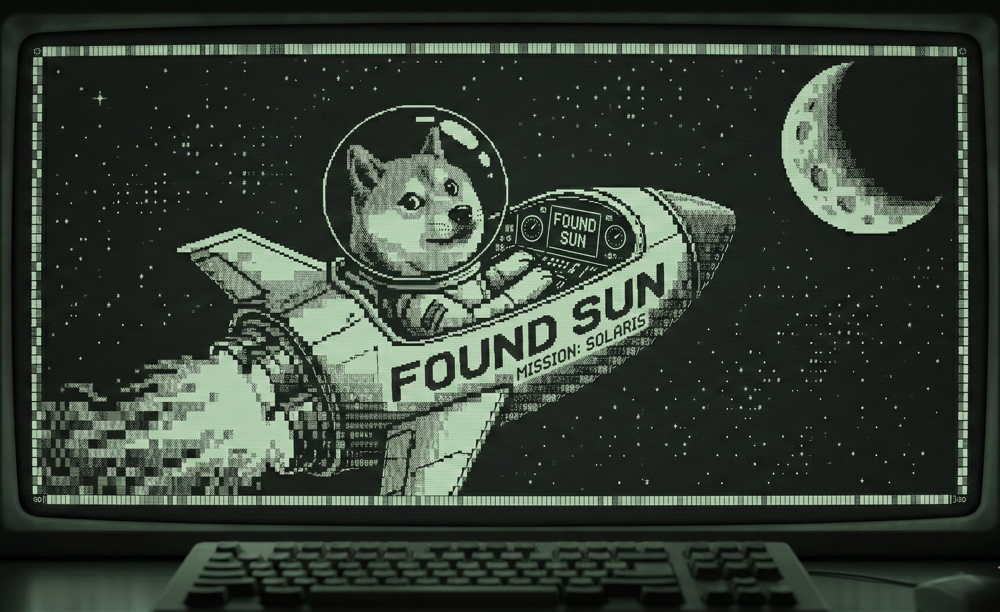

# 👨🏻‍💻 Jean Costa

**`Desenvolvedor FullStack`**

Me Chamo Jean Costa, tenho 21 anos e sou natural de Itapevi SP. Atualmente estou cursando no SENAI de Jandira Desenvolvimento de Sistemas. Estou em busca do meu primeiro emprego na área de programação.

**Formado em Banco de Dados - 2026**

---

  

---

# 🌐 Socials:
 
 

    
    
     
  

 

 ---

### 🤖 Linguagens e Tecnologias

  
  
  
  
  
  
  
  
  
  
  
  
  
  
  
  
  
  
  
  
  
  
  
    
   
  

  

 
 

---
### 📊 Commits
---

<picture>
  <source media="(prefers-color-scheme: dark)" srcset="https://raw.githubusercontent.com/ricardolimaa29/ricardolimaa29/output/pacman-contribution-graph-dark.svg">
  <source media="(prefers-color-scheme: light)" srcset="https://raw.githubusercontent.com/ricardolimaa29/ricardolimaa29/output/pacman-contribution-graph.svg">
  
</picture>

---

> _"Ao infinito... e além!"_  
> — **Buzz Lightyear**

 
 
 
